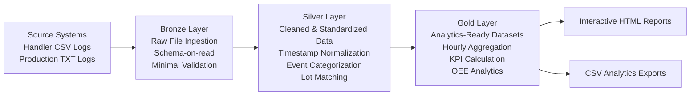
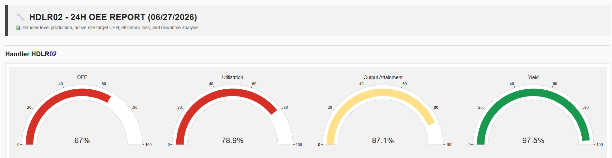
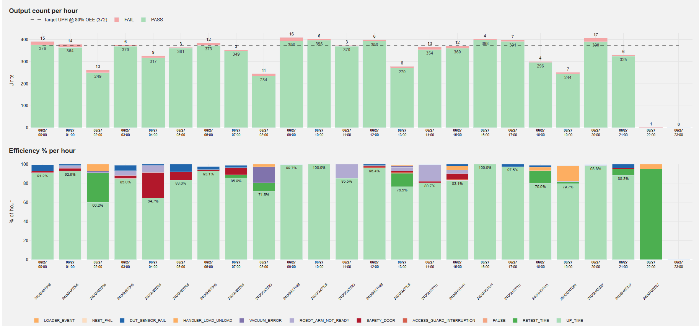
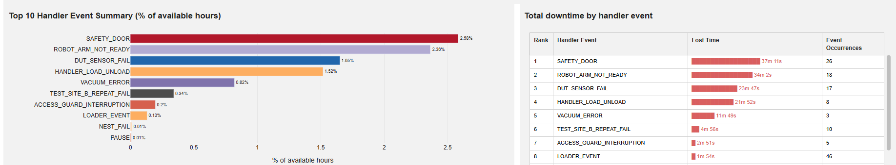
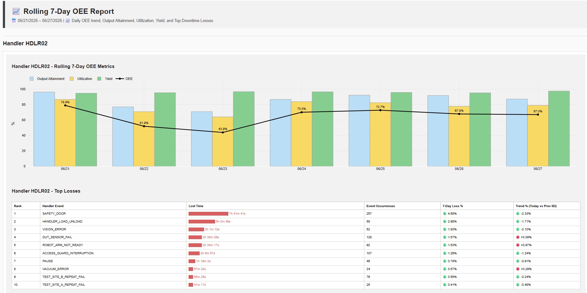

# 📊 Semiconductor OEE Analytics

> **Note:** All data, equipment names, handler identifiers, production lots, station names, event categories, and manufacturing identifiers have been fully anonymized for public portfolio use. No proprietary manufacturing or customer-sensitive information is included.

Production-style semiconductor manufacturing OEE analytics platform built with **Python**, **Pandas**, **NumPy**, and **Plotly**.

---

## 🔎 Overview

This project is an end-to-end manufacturing analytics solution that automates the integration of semiconductor equipment event logs and production test records into engineering-ready Overall Equipment Effectiveness (OEE) reports and interactive HTML dashboards.

The solution demonstrates a production-oriented ETL workflow built using modern data engineering practices, transforming multiple manufacturing data sources into standardized analytics datasets for KPI reporting and operational performance monitoring.

### Key Capabilities

* Automated multi-source file ingestion
* CSV and TXT manufacturing data integration
* ETL transformation and data validation
* Production lot matching across independent systems
* Manufacturing KPI calculation
* Interactive HTML dashboard generation
* Automated CSV analytics exports

The analytics workflow is designed around semiconductor final-test operations, enabling engineering investigations such as:

* Overall Equipment Effectiveness (OEE)
* Equipment utilization
* Production throughput
* Yield monitoring
* Downtime analysis
* Historical performance trending

---

# 🚀 Interactive HTML Reports

The application generates standalone interactive HTML reports that can be opened directly in any modern web browser without requiring Python, databases, or BI software.

## 🔧 Overall 24-Hour Per-Handler OEE Dashboard

Equipment-level dashboard for analyzing individual handler performance.

### Features

* Handler KPI summary
* Hourly production analysis for the whole 24 hours of the previous day
* Equipment downtime monitoring
* Downtime event distribution
* Handler-specific loss analysis

**🌐 Launch Interactive Dashboard Demo:**  

- [oee_per_handler_report_HDLR02.html](https://kenbugasto.github.io/semiconductor-oee-analytics/demo/oee_per_handler_report_HDLR02.html)
- [oee_per_handler_report_HDLR07.html](https://kenbugasto.github.io/semiconductor-oee-analytics/demo/oee_per_handler_report_HDLR07.html)

## 📈 Rolling 7-Day OEE Dashboard

Historical manufacturing dashboard for monitoring KPI trends over time.

### Features

* Daily OEE trend
* Utilization trend
* Output attainment trend
* Yield trend
* Top downtime events
* Seven-day manufacturing performance comparison

**🌐 Launch Interactive Dashboard Demo:**  

[oee_rolling_7day_report.html](https://kenbugasto.github.io/semiconductor-oee-analytics/demo/oee_rolling_7day_report.html)

---

# 🗂️ Manufacturing Data Sources

The ETL pipeline integrates two independent manufacturing systems into a unified analytics model.

## Handler Event Logs (CSV)

Equipment event logs containing:

* Equipment alarms
* Downtime events
* Machine operating status
* Lot movement records
* Equipment activity history

## Production Test Logs (TXT)

Production test records containing:

* Unit-level test results
* PASS / FAIL status
* Test time
* Test flow information
* Site information

After ingestion, both datasets are standardized and matched using production lot information to produce engineering-ready manufacturing analytics.

---

# 🛠️ Technology Stack

| Category            | Technology             |
| ------------------- | ---------------------- |
| Language            | Python                 |
| Data Processing     | Pandas                 |
| Numerical Computing | NumPy                  |
| Visualization       | Plotly                 |
| Reporting           | HTML                   |
| Configuration       | ConfigParser           |
| Data Transfer       | FTP                    |
| Scheduling          | Windows Task Scheduler |

---

# 🏗️ Architecture Decisions

## Why Python?

Python was selected as the primary ETL and analytics platform because the manufacturing data is delivered daily through a structured FTP directory containing curated CSV equipment logs and TXT production records.

Since the source files are already organized, versioned, and consumed as batch datasets, introducing a relational database would add unnecessary complexity without providing significant analytical benefit.

Instead, the application processes the source files directly using Pandas, transforming them into analytics-ready datasets before generating interactive HTML reports and CSV exports.

This lightweight architecture provides an efficient ETL workflow while remaining easy to deploy, maintain, and automate within an engineering environment.

### Benefits

- Direct processing of curated manufacturing files
- No database infrastructure required
- Lightweight deployment
- Fast batch processing using Pandas
- Simplified automation and scheduling
- Interactive reporting using Plotly HTML

## Why Interactive HTML Reports?

Instead of relying on dashboard servers or commercial BI tools, this project generates standalone Plotly HTML reports that engineers can share and explore directly in a web browser.

### Benefits

* No software installation required
* Interactive charts
* Zooming and filtering
* Easy report sharing
* Lightweight deployment

---

## 🏗️ ETL Workflow - Medallion Architecture



---

## 🧩 Analytical Dataset Design

| Layer | Description |
|--------|-------------|
| Bronze | Raw CSV and TXT files from FTP |
| Silver | Cleaned, standardized, matched manufacturing datasets |
| Gold | Hourly KPI datasets powering OEE reports and CSV exports |

---

# 📈 Overall Equipment Effectiveness (OEE)

The platform calculates Overall Equipment Effectiveness using three manufacturing KPIs.

OEE = Utilization × Output Attainment × Yield

* Utilization: Measures productive operating time after accounting for equipment downtime.

* Output Attainment: Measures actual production throughput relative to target manufacturing capacity.

* Yield: Measures manufacturing quality using PASS versus total tested units.

---

## 🐍 Python ETL Example

The pipeline integrates handler CSV event logs with production TXT files using **Pandas** and **NumPy**, while applying defensive validation to handle inconsistent manufacturing data.

```python
# Load handler CSV
handler_df = pd.read_csv(csv_file)

required_cols = ["OccurDateTime", "LotInfo", "HandlerID"]
missing = [c for c in required_cols if c not in handler_df.columns]
if missing:
    raise ValueError(f"Missing columns: {missing}")

handler_df["event_time"] = parse_mixed_datetime(handler_df["OccurDateTime"])
handler_df["duration_sec"] = clean_numeric(handler_df["MSGStartTime"])

# Parse production TXT
prod_df = parse_txt_2d_list(txt_file)

# Match production lots
matched_lots = set(handler_df["LotInfo"]).intersection(prod_df["schedule_no"])

handler_matched = handler_df[
    handler_df["LotInfo"].isin(matched_lots)
]

prod_matched = prod_df[
    prod_df["schedule_no"].isin(matched_lots)
]

# Pandas aggregation
hourly_output = (
    prod_matched
    .groupby(["test_hour", "pf_status"])
    .agg(units=("serial_no", "count"))
    .reset_index()
)

# NumPy KPI calculation
hourly_output["yield_pct"] = np.where(
    hourly_output["units"] > 0,
    hourly_output["PASS"] / hourly_output["units"] * 100,
    0
)
```

### Engineering Concepts Demonstrated

- **Pandas** — CSV ingestion, grouping, aggregation, and ETL transformations
- **NumPy** — vectorized KPI calculations using `np.where()`
- **Defensive Coding** — schema validation, timestamp parsing, numeric cleaning, and safe handling of missing values
- **Manufacturing ETL** — integration of independent CSV and TXT manufacturing systems through production lot matching

## Engineering Discussion

Rather than calculating OEE directly from raw manufacturing logs, the application first transforms production and equipment events into hourly analytical datasets before calculating business KPIs.

This layered approach separates data ingestion, transformation, aggregation, and reporting, making the pipeline easier to validate, maintain, and extend.

The calculation function also follows defensive programming practices to ensure reports remain stable even when manufacturing data is incomplete.

## Defensive ETL Techniques

The implementation includes several safeguards commonly used in production data engineering projects:

* Gracefully handles missing KPI columns
* Prevents divide-by-zero calculations
* Caps Output Attainment at 100%
* Handles zero-production scenarios safely
* Produces standardized KPI outputs for downstream reporting

## Why Hourly Aggregation?

Manufacturing performance changes continuously throughout a production day.

Instead of calculating KPIs directly from daily totals, the ETL pipeline first aggregates production and equipment activity at **hourly grain**, allowing engineers to identify:

* Production bottlenecks
* Temporary downtime events
* Equipment utilization losses
* Throughput fluctuations
* Hourly yield variation

These hourly datasets are then summarized into daily manufacturing KPIs used by both the 24-hour and Rolling 7-Day reports.

---

# 🖼️ Dashboard Screenshots

## 🔧 Overall 24-Hour Per-Handler OEE Report







Features demonstrated:

* Per Handler performance KPIs
* Equipment downtime
* Hourly throughput
* Event distribution
* Loss analysis

## 📈 Rolling 7-Day OEE Report



Features demonstrated:

* Daily OEE trend
* Utilization trend
* Output attainment trend
* Yield trend
* Historical downtime comparison

---

## 🛠️ Data Engineering

The project showcases practical data engineering techniques commonly used in manufacturing analytics environments.

### ETL & Data Integration

* Multi-source ETL pipeline
* CSV and TXT data ingestion
* Manufacturing data integration
* Production lot matching
* Timestamp normalization
* Configuration-driven processing

### Data Quality

* Defensive ETL design
* Missing value handling
* Data validation
* Duplicate record protection
* Standardized KPI generation

### Automation

* Automated report generation
* Scheduled execution
* CSV analytics exports
* Reproducible reporting workflow

---

## 📈 Manufacturing Analytics

The reporting layer transforms raw manufacturing data into engineering-ready performance metrics.

### Manufacturing KPIs

* Overall Equipment Effectiveness (OEE)
* Equipment Utilization
* Output Attainment
* Production Yield
* Hourly Throughput
* Downtime Loss Analysis

### Historical Analytics

* Rolling 7-Day KPI monitoring
* Daily manufacturing trends
* Equipment performance comparison
* Historical downtime analysis
* Productivity monitoring

---

## 💻 Software Engineering

The application is organized using a modular architecture to improve maintainability and support future enhancements.

### Design Principles

* Modular Python architecture
* Separation of concerns
* Reusable helper functions
* Configuration-driven execution
* Lightweight deployment model

---

# 🛣️ Project Roadmap

## ✅ Current Features

* Automated CSV and TXT ingestion
* Manufacturing event analytics
* Production lot matching
* OEE KPI calculation
* Rolling 7-day trend analysis
* Interactive HTML dashboards
* Automated CSV exports

---

## 🚀 Planned Enhancements

Future development will expand the analytics platform beyond equipment performance monitoring.

Planned improvements include:

* SQL-based analytics layer
* Manufacturing data warehouse integration
* Historical production database support
* Automated anomaly detection
* Statistical process control (SPC) dashboards
* Manufacturing trend forecasting
* Expanded manufacturing KPI library
* Interactive engineering filtering

---

# 📚 Key Concepts Demonstrated

This repository demonstrates practical applications of data engineering, analytics engineering, and software engineering within a semiconductor manufacturing environment.

| Data Engineering    | Analytics Engineering   | Software Engineering              |
| ------------------- | ----------------------- | --------------------------------- |
| Multi-source ETL    | OEE KPI Modeling        | Modular Python Design             |
| Data Integration    | Manufacturing Analytics | Reusable Components               |
| Defensive ETL       | Time-Series Analysis    | Configuration-Driven Architecture |
| Data Validation     | KPI Trend Monitoring    | Separation of Concerns            |
| Automated Reporting | Downtime Analytics      | Maintainable Codebase             |


---

## 👤 Author

This project was developed as part of my Data Engineering portfolio.

Key concepts demonstrated include:

- Multi-source ETL
- Manufacturing analytics
- Pandas & NumPy
- Defensive ETL
- Interactive reporting
- KPI modeling

---

## ⭐ If you found this project interesting

If this repository was helpful or provided insight into manufacturing analytics and ETL design, consider giving it a ⭐.

Feedback and suggestions are always welcome.
